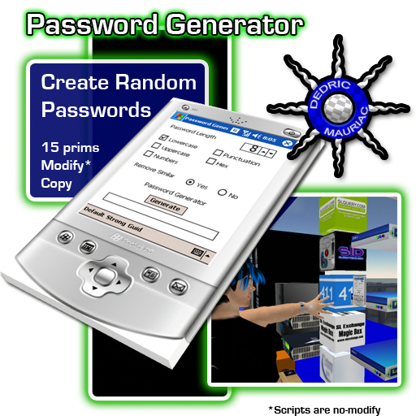

# Password Generator

Create Random Passwords

This little gadget is useful for creating passwords.

Options let you include lowercase, uppercase, hex, numbers, and punctuation.  You can toggle it to prevent similar characters such as 0 (zero) and O (letter oh) to appear in your passwords.  You change the length to be anywhere between 1 and 64 characters long.  Passwords are sent to you through an instant message so that channel scanners can't pick up on it.

Check/uncheck each checkbox to toggle preferences.  
Length of password is adjusted with a numeric up/down control.  
Radio buttons work to remove or use similar looking characters.  
Presets have been added at the bottom to let you quickly change the settings.

Default - 8 characters in lowercase, remove similar characters.
Strong - 12 characters in lowercase, uppercase, numbers, and punctuation.
Guid - 32 characters in hex
    